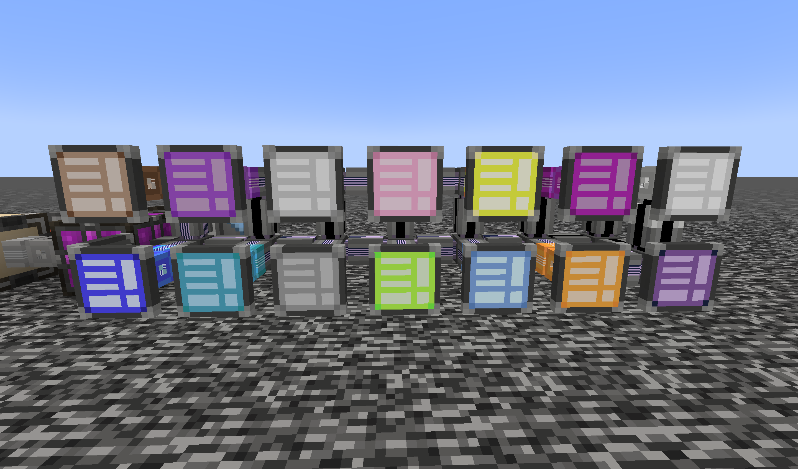

# AE2 Pattern Encoding Access Terminal

Applied Energistics 2のパターンアクセスターミナルとパターンエンコーディングターミナルを1つに統合するアドオンです。MEネットワーク上のパターンを検索しながら即座に編集できる端末パーツを追加し、クラフターの作業効率を大幅に向上させます。

## 主な機能
- 新しいME Pattern Encoding Access Terminalパーツを追加し、AE2標準のパターンアクセス表示とエンコード機能を同一UIに統合
- 無線版を追加 (AE2wtlibが必要)

## 画像

## 開発者向け
1. JDK 17をインストールし、`JAVA_HOME`を設定します。
2. IntelliJ IDEAでリポジトリをクローンします。
3. IntelliJ IDEAの`Run / Debug Configuration`で`Client`を選択して実行します。
* DataGenを更新した場合`Run / Debug Configuration`で`Data`を選択して実行します。

## クレジット
- [Applied-Energistics-2](https://www.curseforge.com/minecraft/mc-mods/applied-energistics-2) (by thetechnici4n)
