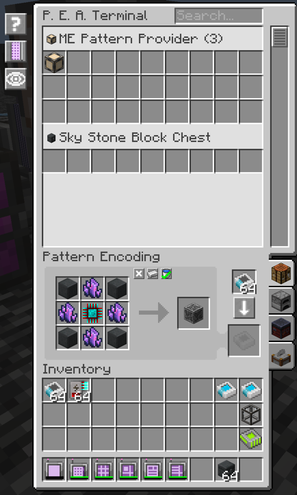

---
navigation:
  parent: index.md
  title: Pattern Encoding Access Terminal
  icon: ae2peat:pattern_encoding_access_terminal
  position: 10
categories:
  - tools
item_ids:
  - ae2peat:pattern_encoding_access_terminal
---

# Pattern Encoding Access Terminal

The Pattern Encoding Access Terminal merges AE2's access and encoding interfaces, letting you browse stored patterns and edit them in place without swapping parts.
Install it on an ME cable and connect it to your network to manage crafting, processing, smithing, and stonecutting recipes from a single screen.

## Recipe

<RecipeFor id="ae2peat:pattern_encoding_access_terminal" />

## Images

